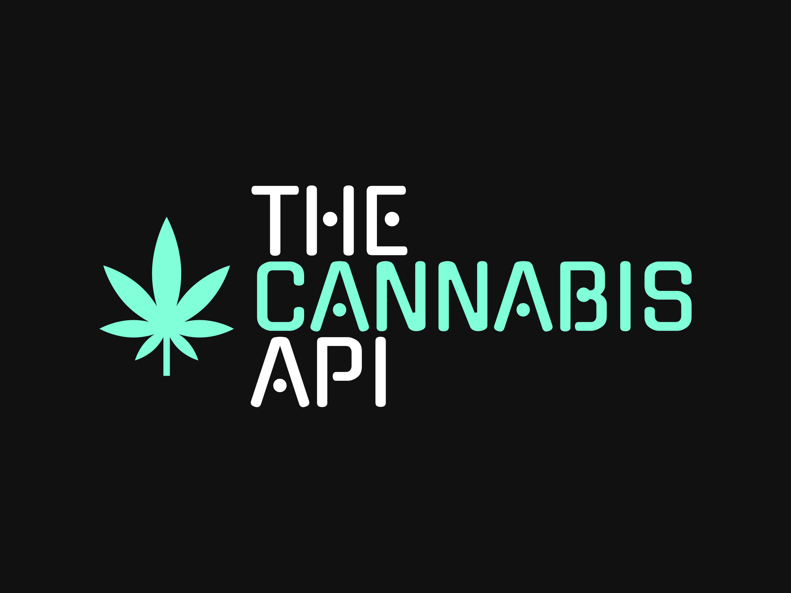
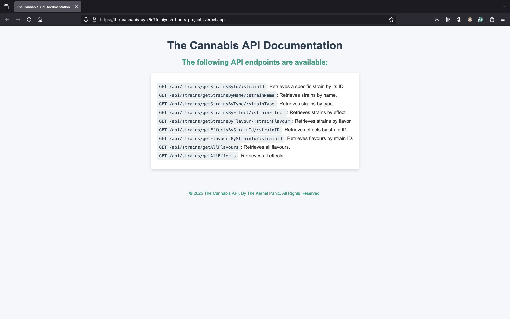
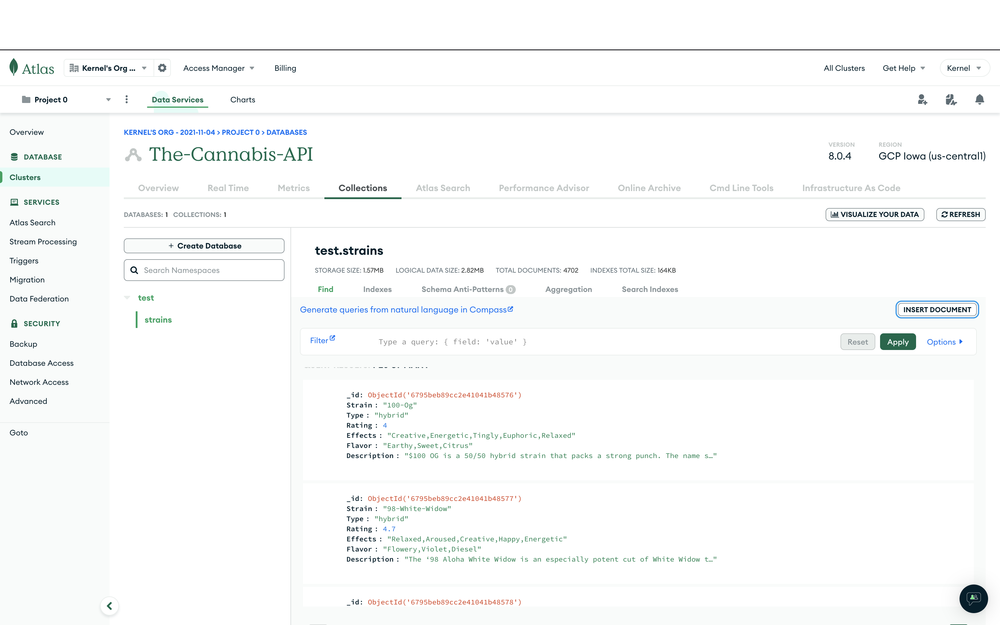
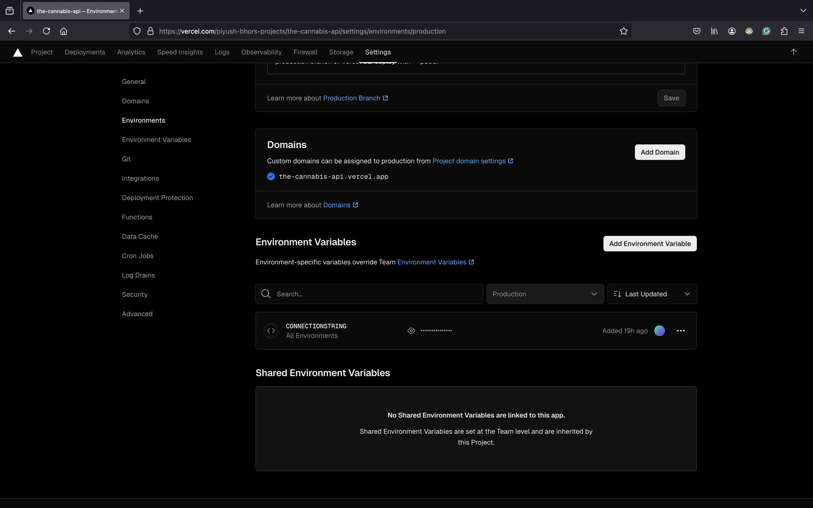

# The Cannabis API

 <br>

[](./LICENSE)


The Cannabis API is a RESTful API that provides comprehensive information about various cannabis strains. It allows you to query and retrieve details such as strain name, type (indica, sativa, or hybrid), rating, effects, flavours, and descriptions. The API is built using Node.js, Express, and MongoDB, and it is hosted on Heroku. The dataset used to populate the API is sourced from Kaggle, specifically the "cannabis.csv" file.

The API is hosted on Vercel at: [https://the-cannabis-ayix5e7fr-piyush-bhors-projects.vercel.app](https://the-cannabis-ayix5e7fr-piyush-bhors-projects.vercel.app).



## Installation

To run the Cannabis API locally, follow these steps:

#### 1. Clone the repository:

```bash
git clone https://github.com/Piyush-Bhor/The_Cannabis_API.git
```

#### 2. Navigate to the project directory:

```bash
cd The_Cannabis_API
```

#### 3. Set up MongoDB Connection:

1.  **Sign Up:** Go to MongoDB Atlas and create a free account.

2.  **Create a Cluster:** Click "Build a Cluster" (free tier), choose a cloud provider and region.

3.  **Create a Database User:** Go to Database Access, click Add New Database User, and set username, password, and "Read and Write" privileges.

4.  **Get Connection String:** Copy the connection string and replace <username> and <password>.

5.  **Add Environemnt Variables:** Add the connection string to `.env`.

    ```
    CONNECTIONSTRING=<connection_string>
    ```

6.  Create Database: In Atlas, create a test cluster and a strain database.

7.  Insert Data: Go to Collections in your cluster, click Insert Document, and paste the contents of cannabis.json.
    

#### 4. Start the Development Server for Testing:

```bash
npm start
```

The Cannabis API is now running locally on `http://localhost:3000`.

## API Endpoints

The following API endpoints are available:

- `GET /`: Shows a README with all the API endpoints.
- `GET /api/strains/getStrainsById/:strainID`: Retrieves a specific strain by its ID.
- `GET /api/strains/getStrainsByName/:strainName`: Retrieves strains by name.
- `GET /api/strains/getStrainsByType/:strainType`: Retrieves strains by type.
- `GET /api/strains/getStrainsByEffect/:strainEffect`: Retrieves strains by effect.
- `GET /api/strains/getStrainsByFlavour/:strainFlavour`: Retrieves strains by flavor.
- `GET /api/strains/getEffectsByStrainId/:strainID`: Retrieves effects by strain ID.
- `GET /api/strains/getFlavoursByStrainId/:strainID`: Retrieves flavours by strain ID.
- `GET /api/strains/getAllFlavours`: Retrieves all flavours.
- `GET /api/strains/getAllEffects`: Retrieves all effects.

## Deployment

The Cannabis API is deployed on Vercel and can be accessed at: [https://the-cannabis-ayix5e7fr-piyush-bhors-projects.vercel.app](https://the-cannabis-ayix5e7fr-piyush-bhors-projects.vercel.app).

To Deploy your own instance of The Cannabis API, do these additional steps:

1. Create a free account on Vercel.

2. Install Vercel - `npm install -g vercel`

3. Add the connection string to Vercel.

   

   In the terminal run `vercel env pull`. This will create a `.env.local` file that will have your connection string. Vercel will automatically add it to your `.gitignore`.

4. Run `npm run deploy`

## Contributing

Contributions to the Cannabis API project are welcome! If you find any bugs, have suggestions for improvements, or would like to add new features, please submit an issue or open a pull request.

## License

The Cannabis API is released under the [MIT License](https://opensource.org/licenses/MIT). Please see the [LICENSE](https://github.com/Piyush-Bhor/The_Cannabis_API/blob/main/LICENSE) file for more details.

## Dataset

The dataset used in this project is sourced from Kaggle: [cannabis.csv](https://www.kaggle.com/datasets/kingburrito666/cannabis-strains). The "cannabis.csv" file contains the strain data used to populate the API.

## Contact

For any questions or inquiries, please reach out to project maintainer Piyush Bhor:

- Email: piyushbhor22@gmail.com
- GitHub: [Piyush-Bhor](https://github.com/Piyush-Bhor)
